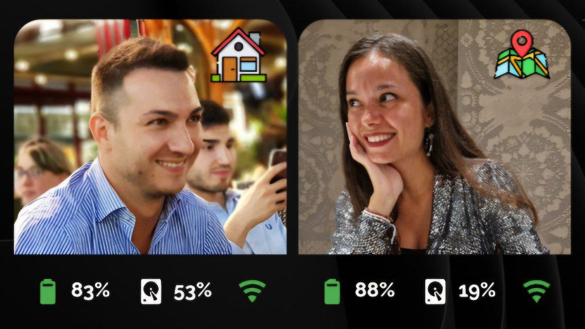
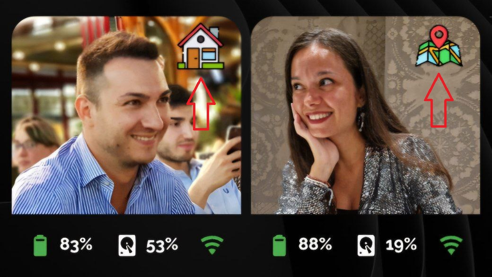

<h2><strong>🧑🏻 Big Person card for home assistant</strong></h2>

CARD PERSON con immagini grandi, presenza e altre info, per com'è impostata la geolocalizzazione mostra solo lo stato di HOME e NOT HOME (non tutte le zone censite in HA):

Volevo condividere una scheda che ho creato con l'aiuto delle varie community per visualizzare le informazioni di una persona tramite l'utilizzo dell'app HA companion.

Istruzioni:

da Hacs, installare:
1. button-card
2. stack-in-card
3. mushroom

poi ...
1. nel file HA sensor.yaml, inserire il contenuto di person_card_big_sensor.yaml, se non si dispone del file sensor.yaml è necessario creare sensor.yaml nella cartella config/, aprire il file configuration.yaml e inserire questa riga: sensor: !include sensor.yaml
2. sul vostro smartphone installare l'app Home Assistant companion
3. dall'app andate in impostazioni, app complementare, gestione sensori, abilitate tutti i sensori che servono e che trovare nei vari file di configurazioni: sensori di rete,sensori ultimo riavvio, sensori di prossimità, sensori batteria, sensori di archiviazione, sensori di attività, sensori di posizione.
4. incollare le immagine delle vostre foto dentro la cartella www/person e le icone dentro la cartella www/person/icon
5. in HA create una card manuale e incollate il contenuto del file: person_card_big.yaml
6. all'interno del codice della card e del codice inserito nel sensor.yaml, dovete andare a sostituire tutti i miei sensori chiamati simone, con i vostri appena abilitati

Alla fine ci troveremo ad avere i 2 simboli come vedete in questa foto: Simone è in casa e Martina è fuori casa

Enjoy!

----------------------------------------

Would you like to give me a hand? The content of this page is completely free of charge and the purpose is certainly not to make money. If you would like to lend me a hand to help with expenses and lost time, you have the following ways:

Make your Amazon purchases from this link:

Join our Telegram channel dedicated to Home Assistant news:

Join our Telegram channel dedicated to home automation products, there are lots of offers:

